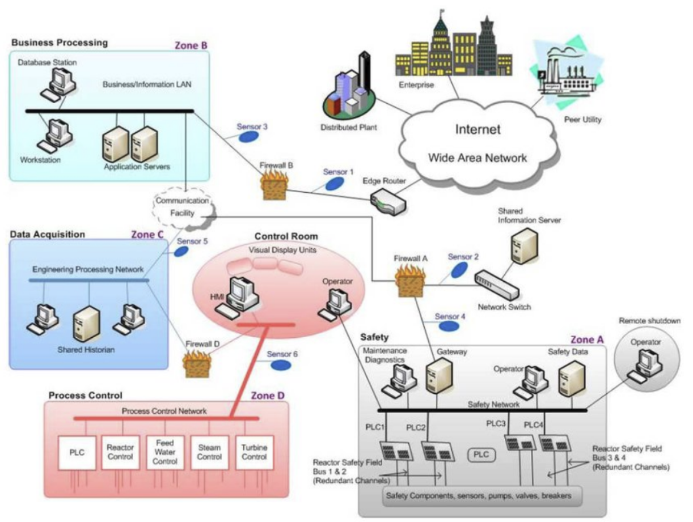

# Scope

- [Scope](#scope)
- [Information Given](#information-given)
- [Collection](#collection)
  - [Email](#email)
  - [Git](#git)
  - [Tech](#tech)
  - [Remote VDI](#remote-vdi)
  - [Network Diagram](#network-diagram)
  - [Credential](#credential)

# Information Given
```
atomic-nuclear.site
```

# Collection

## Email
* (SSL Cert Admin / Senior Scientist)
iyer@atomic-nuclear.site

```
UserName: iyer
Passwd: Iyer@123
Port: 110,143
```

* (SSL Cert Admin)
admin@atomic-nuclear.site
* (Senior Principal Scientist)
homi@atomic-nuclear.site

## Git
- [GitHub - atomic-nuclear/atomic-nuclear.github.io](https://github.com/atomic-nuclear/atomic-nuclear.github.io)
- [GitHub - atomic-nuclear/Scada-Repo](https://github.com/atomic-nuclear/Scada-Repo)
- [GitHub - atomic-nuclear/Critical-Information: This Repository Contains Sensitive Information Related to Nuclear Power Plant.](https://github.com/atomic-nuclear/Critical-Information)

## Tech
* S3 bucket
  * Location: Unknown but Scientist should have access

## Remote VDI
- Remote VDI Password:  `Sc!ent!st@1221`

## Network Diagram
  

## Credential

```
# 192.168.8.3 (SSH)
iyer / Iyer@123
webadmin / WrongPassword
```

<br/>

```
# 10.1.3.1:1234 (Jenkins)
admin / admin
autoadmin / Jenk!nsADMIN
```