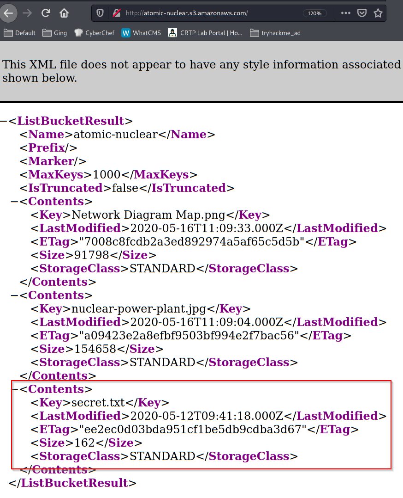
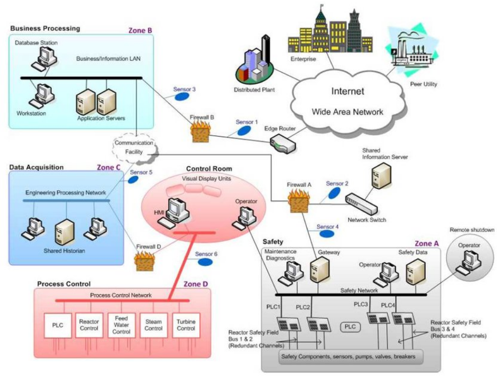
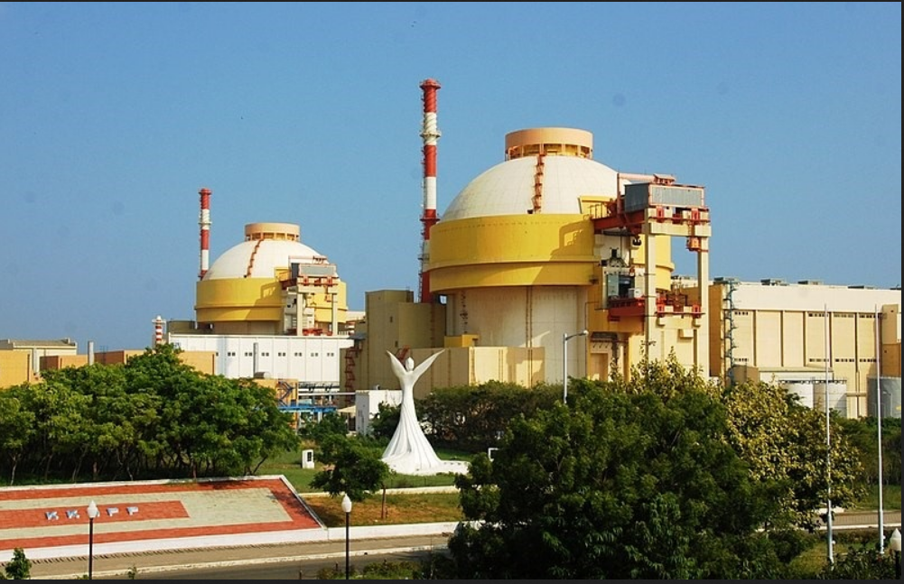

# OSINT

<!-- toc -->

- [OSINT](#osint)
  - [Google](#google)
  - [GitHub](#github)
    - [Main Page](#main-page)
    - [Projects](#projects)
      - [S3 Enumeration](#s3-enumeration)
        - [VDI Password revealed](#vdi-password-revealed)
        - [Internal Network Diagram](#internal-network-diagram)
        - [Physical appearance](#physical-appearance)
  - [LinkedIn](#linkedin)
    - [Company Page](#company-page)
    - [Employees](#employees)

<!-- tocstop -->

## Google

```
"atomic-nuclear.site"
```

Identified the LinkedIn page and GitHub repos of the target company.

<br/>

## GitHub

### Main Page
[atomic-nuclear · GitHub](https://github.com/atomic-nuclear)

### Projects
- [GitHub - atomic-nuclear/atomic-nuclear.github.io](https://github.com/atomic-nuclear/atomic-nuclear.github.io)
- [GitHub - atomic-nuclear/Scada-Repo](https://github.com/atomic-nuclear/Scada-Repo)
- [GitHub - atomic-nuclear/Critical-Information: This Repository Contains Sensitive Information Related to Nuclear Power Plant.](https://github.com/atomic-nuclear/Critical-Information)

Upon checking all of the repos, the repo **atomic-nuclear/Critical-Information** contains an indicator of AWS S3 usage:

```
Our Scientists kept some information which is use for remote accessing nuclear powerplant on AWS S3 Bucket. 
```

> Scientists of the company would be an attack vector to obtain sensitive information
> - Phishing for example

<br/>

#### S3 Enumeration
Use the tool **cloud_enum** to perform a s3 discovery
> Source:
> [GitHub - initstring/cloud_enum: Multi-cloud OSINT tool. Enumerate public resources in AWS, Azure, and Google Cloud.](https://github.com/initstring/cloud_enum)

```
sudo apt install python3-pip
pip3 install virtualenv
git clone https://github.com/initstring/cloud_enum.git
cd cloud_enum
virtualenv .
source ./bin/activate
pip3 install -r requirements.txt
python3 cloud_enum.py -k atomic-nuclear
```


 1](images/9d5fd29c61254fb9707d393ef0c2793b55eb58f07bb72d03c9d7a3056a98393a.png)  

An open S3 bucket was identified. Browse the S3 bucket then:
  


- An interesting file **secret.txt** was identified

<br/>

##### VDI Password revealed

Browsing <http://atomic-nuclear.s3.amazonaws.com/secret.txt>:
```
Atomic Nuclear PowerPlant Site Configuration : atomic-nuclear.site

Remote VDI Password:  Sc!ent!st@1221  


Note: This File Contains Sensitive Information. 
```

> Sensitive information:
> Remote VDI Password:  Sc!ent!st@1221

<br/>

##### Internal Network Diagram
<http://atomic-nuclear.s3.amazonaws.com/Network%20Diagram%20Map.png>

  


<br/>

##### Physical appearance
<http://atomic-nuclear.s3.amazonaws.com/nuclear-power-plant.jpg>
  

<br/>

## LinkedIn

### Company Page

[Atomic Nuclear Power Plant ](https://in.linkedin.com/company/atomic-nuclear)

  


* Website
  https://atomic-nuclear.site 
* Industry
  Industrial Automation 
* Company size
  51-200 employees (6 on LinkedIn) 
* Headquarters
  Bengaluru, Karnataka 
* Type
  Government Agency 

### Employees

1. Nuclear Head - Nuclear Plant Administrator
  <https://www.linkedin.com/in/nuclear-plant-administrator-171a0a1a9/>
  
2. Senior Principal Scientist - Homi Jehangir Bhabha
   homi@atomic-nuclear.site
   https://www.linkedin.com/in/homi-jehangir-bhabha-589b081a9/

3. Instrument Technician - Hafiz Muhammad Naveed
   https://www.linkedin.com/in/hafiz-muhammad-naveed-0732a8179/
   
4. Senior Scientist - Iyer Murty
   iyer@atomic-nuclear.site
   https://www.linkedin.com/in/iyer-murty-bbbb011a9/

5. Data Scientist - Anil Kakodkar
   https://www.linkedin.com/in/anil-kakodkar-370b0b1a9/

6. Junior Research Analyst - Srinivasa Krishnan
   https://www.linkedin.com/in/srinivasa-krishnan-281b111a9/